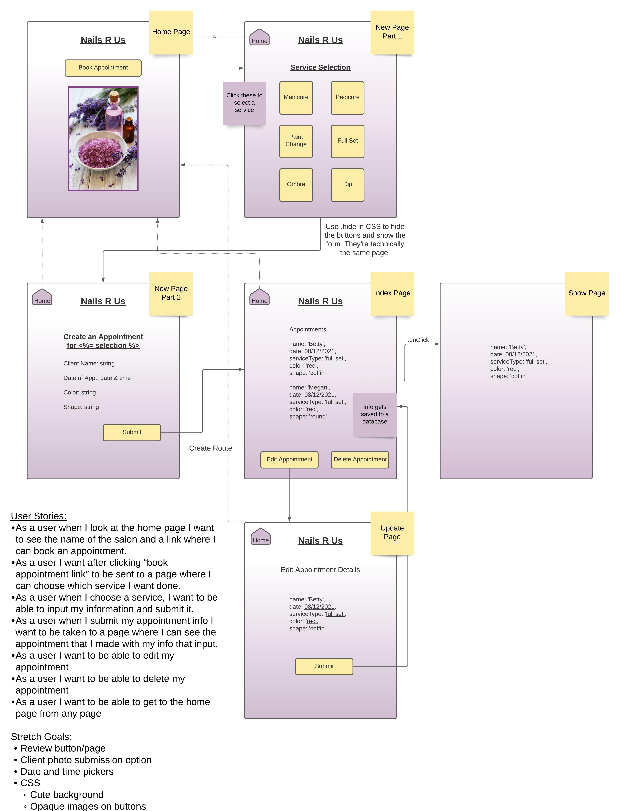

# SEI Project One: Nail Website
 
## Description 
This application creates a website that allows clients to create accounts and schedule various services at a nail salon. It also saves the client’s appointments within their account.
 
## Technologies Used
* We utilized CSS for the website’s appearance and formatting.
* EJS for website requests. (get, post, etc.)
* JavaScript for controllers and models. 
 
## Challenges Faced
A challenge we faced was managing both the formatting of the website while still adding additional functionality features to it. 
 
## Future Features
* We hope to implement a feature that blocks out time slots if they’ve already been scheduled. 
* We want to allow customers to leave reviews and pictures of their finished services. 
 
## User Stories
### Home Page
* NavBar 
    * As a user, when I click "Book Appointment" I want to be directed to the Service Selection page. 
    * As a user, when I click the Appointment List, I want to be directed to the Appointment List page. 
    * As a user, when I click "Logout" I want to receive a confirmation message that I have logged out. 
* As a user, when I click "Signup" I want to be directed to the Sign Up page.
* As a user, when I click "Login" I want to be directed to the Log In page.

### Service Selection Page
* NavBar 
    * As a user, when I click "Book Appointment" I want to be directed to the Service Selection page. 
    * As a user, when I click the Appointment List, I want to be directed to the Appointment List page. 
    * As a user, when I click "Logout" I want to receive a confirmation message that I have logged out. 
* As a user, when I click on a service, I want to be directed to the Create Appointment page.

### Create Appointment Page
* NavBar 
    * As a user, when I click "Book Appointment" I want to be directed to the Service Selection page. 
    * As a user, when I click the Appointment List, I want to be directed to the Appointment List page. 
    * As a user, when I click "Logout" I want to receive a confirmation message that I have logged out. 
* As a user, when I fill in the inputs and click the "Book Appointment" button, I want to be directed to the All Nail Appointments page, where my appointment information will be listed.

### All Nail Appointments Page
* NavBar 
    * As a user, when I click "Book Appointment" I want to be directed to the Service Selection page. 
    * As a user, when I click "Logout" I want to receive a confirmation message that I have logged out. 
* As a user, when I select "Edit Appointment", I want to be directed to the Edit Appointment page.
* As a user, when I select "Delete", I want to delete the respective appointment. 

### Edit Appointment Page
* NavBar 
    * As a user, when I click "Book Appointment" I want to be directed to the Service Selection page. 
    * As a user, when I click the Appointment List, I want to be directed to the Appointment List page. 
    * As a user, when I click "Logout" I want to receive a confirmation message that I have logged out. 
* As a user, when I edit any information on the Edit Appointment page, I want to see that updated information confirmed when I click "Update Appointment".
 
### Appointment Confirmation Page
* NavBar 
    * As a user, when I click "Book Appointment" I want to be directed to the Service Selection page. 
    * As a user, when I click the Appointment List, I want to be directed to the Appointment List page. 
    * As a user, when I click "Logout" I want to receive a confirmation message that I have logged out. 
* As a user, I want to see my updated appointment information on this page.

## Wireframe

## What was your motivation? Why did you build this project? What problem does it solve? 
This project was assigned to allow us to build a full stack web application using Express, Node, EJS, Mongoose, and MongoDB. It will allow clients to make and change their appointments at a hypothetical nail salon, without having to call or be on hold with the staff. It also allows staff to focus on providing services, rather than taking calls for appointments. 

## Screenshots of the App?
